# 使用说明书

HAK 180

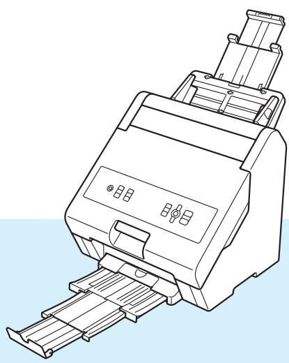

## 简介

## 重要提示

 本文档的内容以及本产品的规格可能会有变化，恕不另行通知。

 严禁未经授权擅自复制或重制本文档的任何部分或全部内容。

 Brother 保留对本说明书中包含的规格和材料进行更改而不进行通知的权利，并且对于依赖提供的材料（包括但不限于印刷以及与发布有关的其他错误）所导致的任何损害 （包括间接损害）概不负责。

 请注意，对于使用本产品或通过本产品制作的内容造成的任何损坏或利润损失，或者故障、维修或耗材导致的数据消失或更改，或者第三方提出的任何索赔，我们不承担任何责任。

 对于保养、调整或维修事宜，请联系 Brother 呼叫中心或您当地的 Brother 经销商。

 如果本设备工作不正常或出现任何功能异常，请关闭本设备，拔下所有电源线，然后联系 Brother 呼叫中心或您当地的 Brother 经销商。

 在使用设备之前，请务必阅读设备随附的所有文档，以获得有关安全和正确操作的信息。

 ©2021 Brother Industries, Ltd. 保留所有权利。

## 目录

1 常规信息 1
1.1 提示定义....1
1.2 产品简介....1

2 Brother 设备简介 2
2.1 设备....2
2.1.1 前视图....2
2.1.2 后视图....3
2.2 操作面板和 LED 指示灯....4

3 使用本设备之前 6
3.1 打开设备包装并检查组件....6
3.2 去除保护材料....7
3.3 初始设置....9
3.3.1 连接设备并安装进纸托板和烫金膜盒....9
3.3.2 选择液晶显示屏语言（仅第一次开机时）....11
3.4 安装烫金膜盒....12
3.4.1 装入全幅烫金膜盒....12
3.4.2 装入半幅烫金膜盒....14
3.4.3 取出烫金膜盒支架和烫金膜盒组件....16

4 介质规格 19
4.1 可接受的介质....19
4.2 不适用的介质....20
4.3 其他规格....21
4.3.1 进纸托板容量....21
4.3.2 避免卡纸的上边距要求....21

5 使用设备 22
5.1 转印....22
5.2 将烫金膜转印到双面纸张上....23
5.3 装入介质....23
5.3.1 装入标准尺寸介质....24
5.3.2 装入非标准尺寸介质....26

6 更改设置 27
6.1 访问主菜单....27
6.2 菜单项....28
6.3 提高转印质量....29
6.3.1 调整转印温度....29
6.3.2 更改送纸速度....30
6.4 节省烫金膜模式....31
6.4.1 仅将烫金膜转印到纸张右上方（顶部）....32
6.4.2 仅将烫金膜转印到纸张的下半部分（跳过）....33

6.4.3 仅将烫金膜转印到纸张中间部分（中间）....34
6.4.4 关闭节省烫金膜模式....35
6.5 收藏....36
6.5.1 将收藏设置分配给操作面板按键....36
6.5.2 调出收藏....36
6.5.3 覆盖或删除收藏....37
6.6 重置设置....38
6.7 更改介质送入压力....39

7 日常维护 40
7.1 清洁设备的外部....40
7.2 清洁分离辊....41
8 故障排除 42
8.1 概述....42
8.2 确定问题....42
8.2.1 一般设备操作....42
8.2.2 打印质量问题....43
8.2.3 介质送入问题....44
8.3 卡纸....45
8.3.1 如果卡纸导致“无进纸”错误....45
8.3.2 如果卡纸发生在设备内部....46
8.3.3 如果纸张卡纸和烫金膜卡纸同时发生....48
9 规格 50
9.1 一般规格....50
9.2 打印介质规格....52
9.3 设备规格....52
9.4 耗材....52
10 错误消息 53
11 附录 54
11.1 Brother 帮助和客户支持....54
11.1.1 FAQ（常见问题解答）....54
11.1.2 Brother 联系信息....54
11.2 法规....55
11.2.1 开放源代码许可备注....55
11.2.2 客户创作的设计侵犯版权....55
11.2.3 不保证 HAK 180 的商业使用可获得利润....55

感谢您购买 Brother HAK 180！阅读使用说明书将帮助您充分利用设备。

## 1.1 提示定义

在这份使用说明书中，使用了以下符号：

<table><tr><td>警告</td><td>“警告”表示可能导致人员死亡或严重受伤的潜在危险情况。</td></tr><tr><td>重要事项</td><td>“重要事项”表示可能导致财产损失或产品功能丧失的潜在危险情况。</td></tr><tr><td>注释</td><td>提示图标指示有用的提示和补充信息。</td></tr><tr><td>粗体</td><td>粗体字表示设备的操作面板上的按键。</td></tr><tr><td>斜体</td><td>斜体字强调应当注意的要点或提示您参考相关主题。</td></tr><tr><td>括号中的文字</td><td>括号中的文字表示在设备液晶显示屏上显示的消息。</td></tr></table>

## 1.2 产品简介

HAK 180 是一款烫金机，它采用热定影技术将烫金膜转印到许多不同类型且已预先打印的介质上。该烫金机不需要安装额外的驱动程序或软件即可使用，与全幅和半幅烫金膜盒都兼容，并且颜色丰富。有关支持的介质详细信息，请参见第 52 页上的打印介质规格。

## 2.1 设备

## 2.1.1 前视图

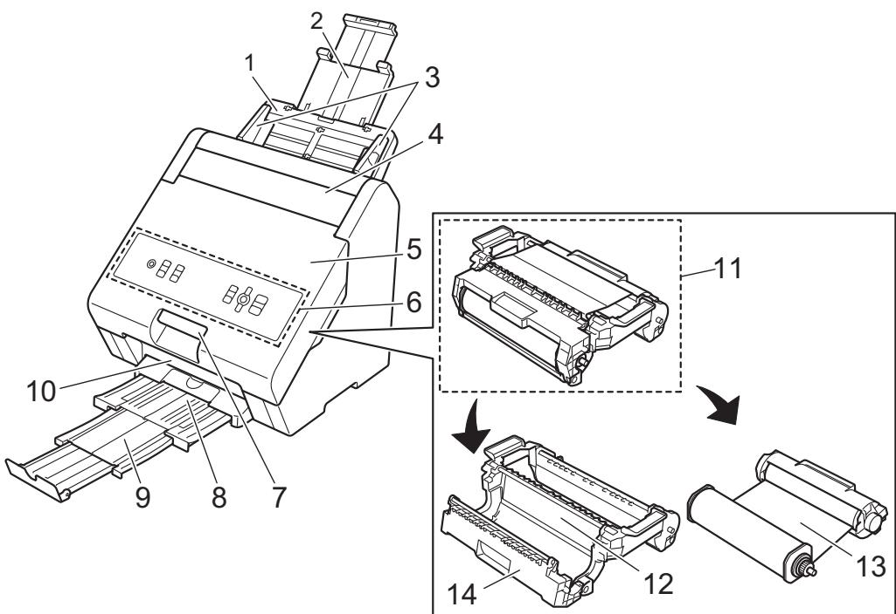

1 进纸托板

将介质装入进纸托板中。

2 可伸缩进纸托板翼板调整长度以适合介质尺寸。

3 导纸板

4 进纸调节器舱盖调整进纸调节器。

打开可使用烫金膜盒支架和烫金膜盒组件。

使用操作面板按键打开和关闭设备、开始和结束烫金膜转印以及更改设置。

7 前盖把手用于打开前盖。

8 出纸托板

从此托板输出已完成的介质。

Brother 设备简介

## 9 可伸缩出纸托板翼板

调整长度以适合介质尺寸。

10 出纸槽

设备从此处输出已完成的介质。

2

11烫金膜盒支架和烫金膜盒组件

12 烫金膜盒支架

13 烫金膜盒

14 烫金膜盒支架盖

## 2.1.2 后视图

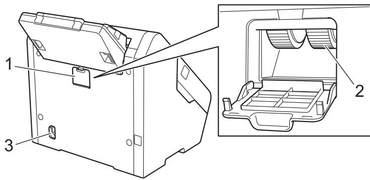

1 分离辊舱盖

打开可访问分离辊。

2 分离辊

3 电源线接口

将电源线连接到电源线接口。

## 重要事项

请务必使用随机附带的电源线。

## 2.2 操作面板和 LED 指示灯

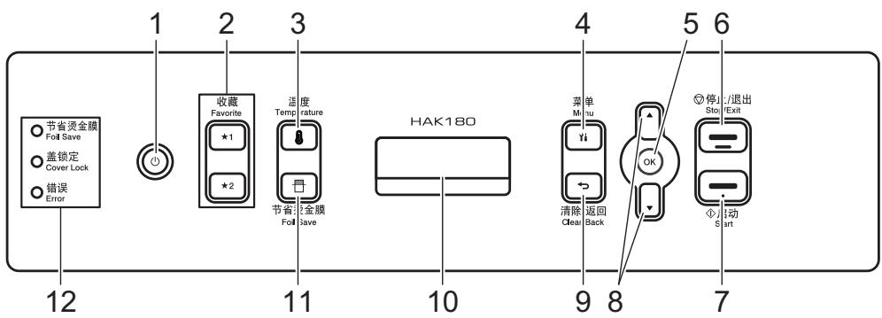

2

1

（打开 / 关闭电源）

2

(Favorite1) （收藏 1） / (Favorite2) （收藏 2）

保存收藏，或者调出已保存的收藏 （有关详细信息，请参见第 36 页上的收藏）。

3

(Temperature) （温度）

更改转印温度 （有关详细信息，请参见第 29 页上的调整转印温度）。

4

(Menu) （菜单）

显示主菜单。

5 (OK) （确定）

接受设置或数值。

6

(Stop/Exit) （停止 / 退出）

取消烫金膜转印。

7

(Start) （启动）

开始烫金膜转印。

8 ▼ ▲

导航主菜单，以及选择和更改设置。

9

(Clear/Back) （清除 / 返回）

清除您在主菜单中输入的数值，或者返回到上一个菜单屏幕。

10 液晶显示屏

11

(Foil Save) （节省烫金膜）

配置节省 ( 烫金膜 ) 模式 （有关详细信息，请参见第 31 页上的节省烫金膜模式）。

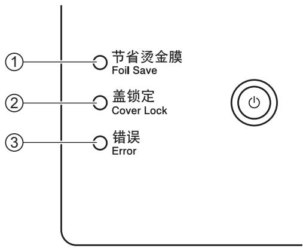

1 Foil Save （节省烫金膜）

亮起：正在以节省烫金膜模式转印烫金膜。

熄灭：正在以标准模式转印烫金膜。

## 注释

有关如何启用或禁用节省烫金膜模式的详细信息，请参见第 31 页上的节省烫金膜模式。

2 Cover Lock （盖锁定）

亮起：在烫金膜转印期间或者当设备内部的温度很高时，将会锁住前盖。

熄灭：前盖处于解锁状态。

3 Error （错误）

亮起：发生错误。（有关错误的详细信息，请参见第 53 页上的错误消息。）

熄灭：设备正常工作。

## 注释

当超过一分钟未操作设备或者未装入介质时，液晶显示屏背光灯将会熄灭。要点亮背光灯，请按设备操作面板上的任何按键或装入介质。

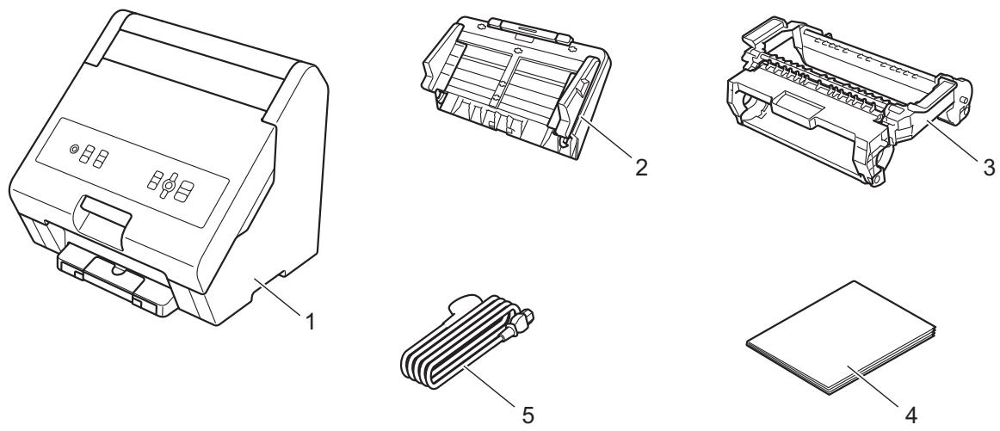

1 烫金机

2 进纸托板

3 烫金膜盒支架 （预安装）

4 产品安全手册 / 快速安装指南

5 电源线

在使用本设备之前，请务必阅读产品安全手册。

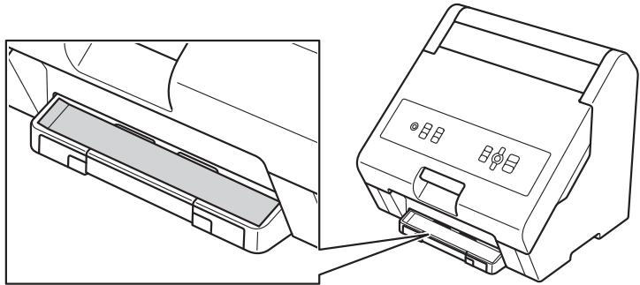

c 去除进纸托板槽的保护材料，如图中所示。

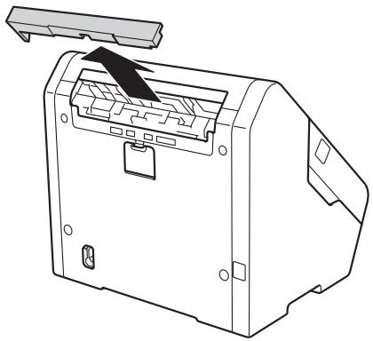

## 打开前盖。

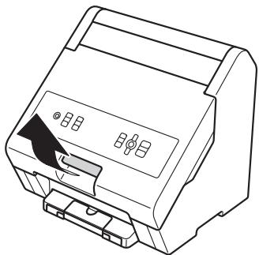

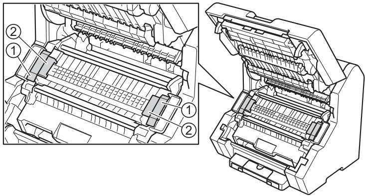

a 将附带提供的电源线连接到电源线接口 1 ，然后将电源线插头插入到 220 V-240 V 电源插座 2。确保电源线插头完全插入到电源插座中。

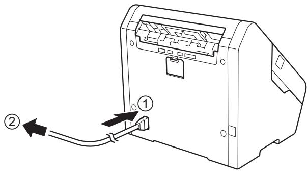

## 重要事项

请务必使用随机附带的电源线。

b 安装进纸托板。

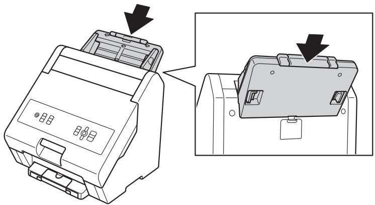

打开前盖。

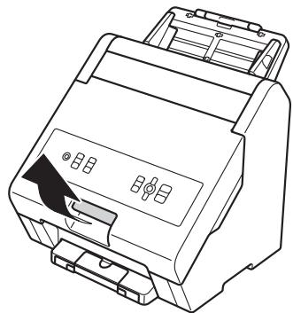

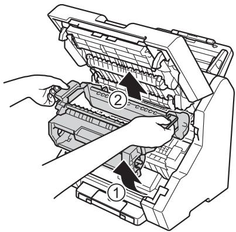

e 将烫金膜盒装入烫金膜盒支架中。

有关详细信息，请参见：

 第 12 页上的装入全幅烫金膜盒

 第 14 页上的装入半幅烫金膜盒

f 将烫金膜盒支架和烫金膜盒组件装入设备中。

g 用力向下合上前盖，并使其锁定到位。如果前盖未完全关闭，设备将不会工作。

[ 请等待] 会短时间显示在液晶显示屏上。

b 当 [ 选择语言 ] 显示在液晶显示屏上时，按 (OK) （确定）。默认语言会显示在液晶显示屏上。

c 按 ▼ 或 ▲ 选择所需的语言，然后按 (OK) （确定）。

## 3.4.1 装入全幅烫金膜盒

a 打开烫金膜盒支架盖。

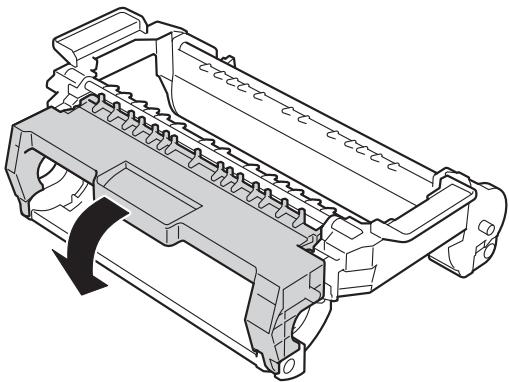

b 将烫金膜盒的烫金膜缠绕面放入烫金膜盒支架中。确保烫金膜盒的圆角部分 1 对准烫金膜盒支架盖上的卡槽 2。

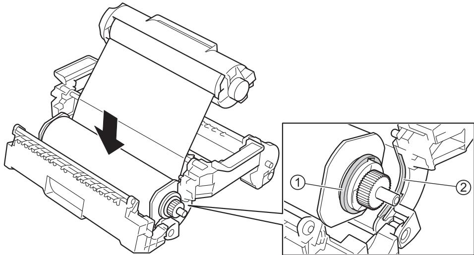

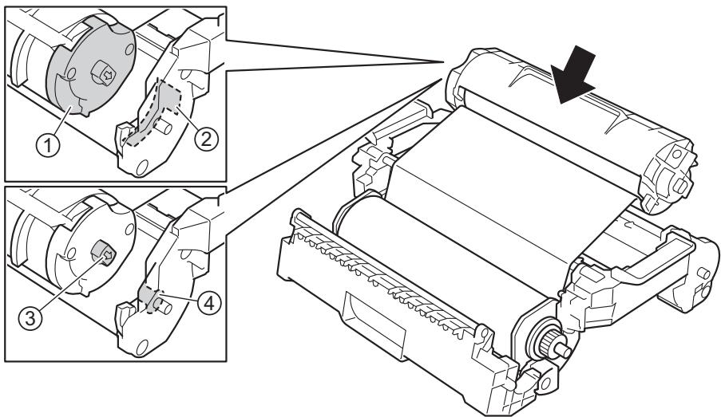

## 向下轻推烫金膜盒，直到它锁定到位。

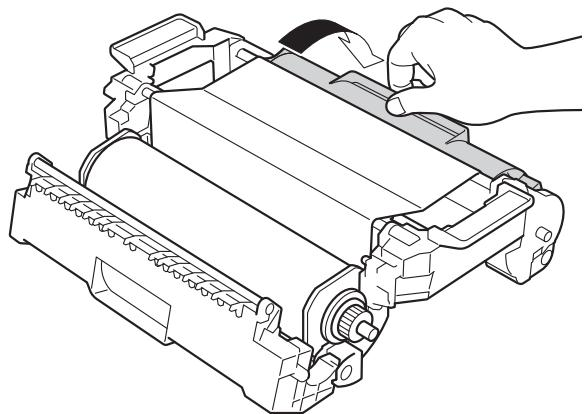

合上烫金膜盒支架盖，直到它锁定到位。

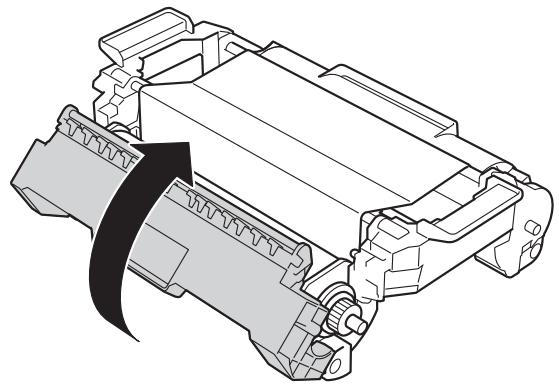

f 如果烫金膜松弛，请顺时针转动主轴 1 以消除松弛。

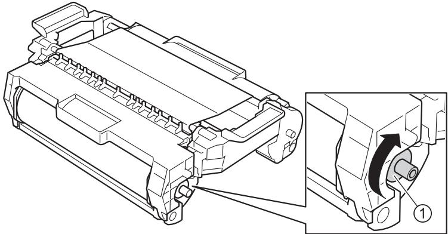

## 3.4.2 装入半幅烫金膜盒

• 对于半幅烫金膜盒，可以将烫金膜居中对齐或左对齐。

• 不支持右对齐。

• 出厂时，烫金膜为左对齐 （面 “2”）。

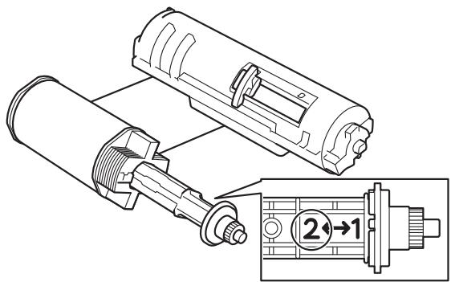

去除固定胶带 1 和保护材料 2。

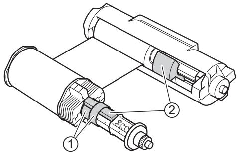

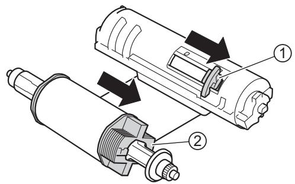

c 将烫金膜盒装入到烫金膜盒支架中，如第 12 页上的装入全幅烫金膜盒一节中所述。

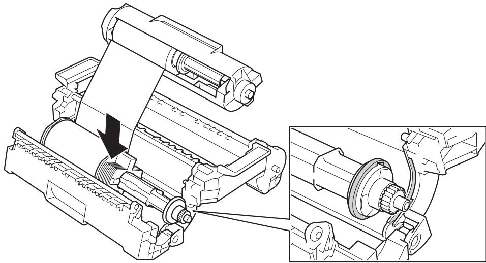

a 确保 Cover Lock （盖锁定） LED 指示灯熄灭。

打开前盖。

c 提起烫金膜盒支架和烫金膜盒组件的下半部分 1，然后将整个烫金膜盒支架和烫金膜盒组件 2 向上提起，以将它从设备中取出。

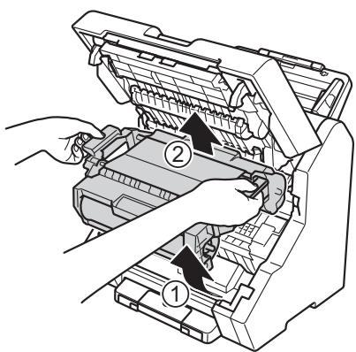

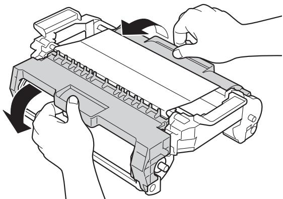

e 将烫金膜盒的两端向上提起，以将烫金膜盒从烫金膜盒支架中取出。

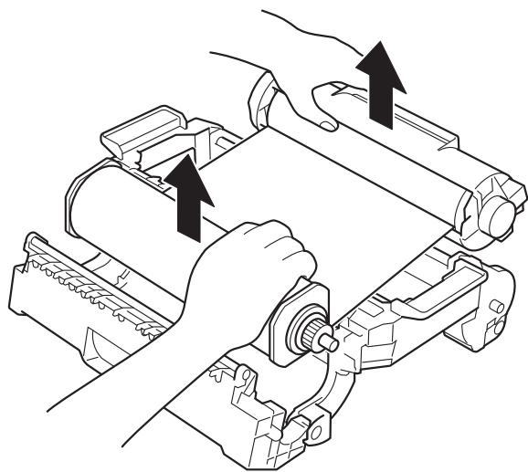

缠绕烫金膜以拉紧。

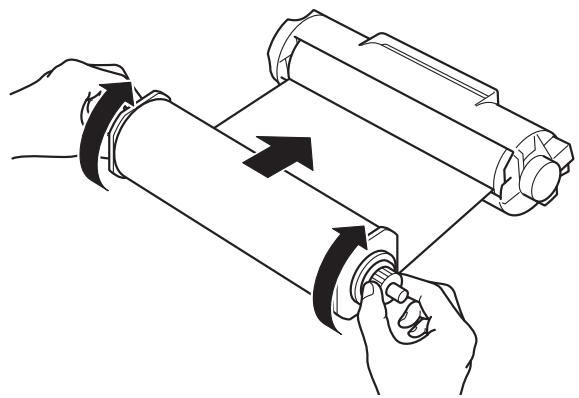

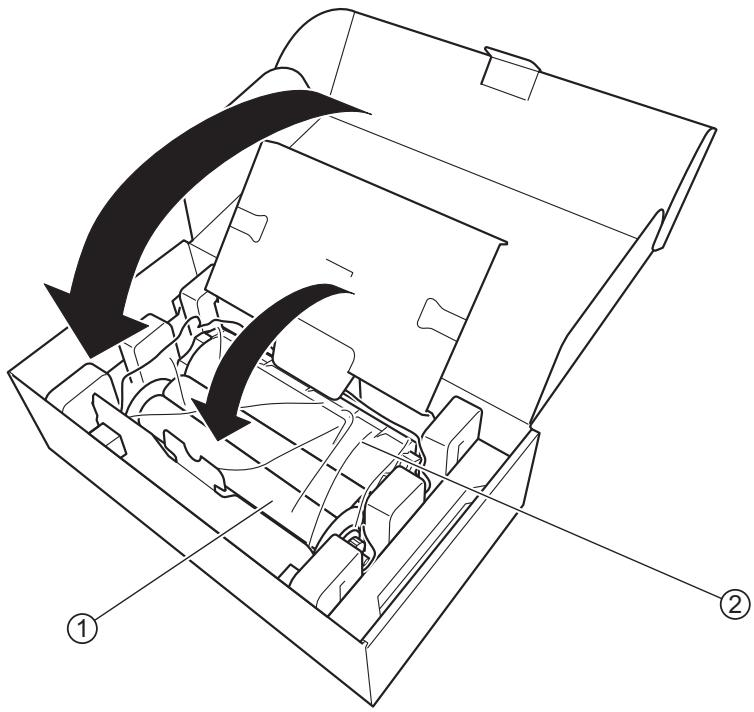

1 烫金膜盒的烫金膜缠绕面

2 烫金膜盒的框架面

• 存放在远离温度高和湿度高的环境。

• 存放在远离火和过热的位置。

<table><tr><td>长度:</td><td>90 mm 到 500  $mm^1$ </td></tr><tr><td>宽度:</td><td>55 mm 到 225 mm</td></tr><tr><td>重量</td><td>90  $g/m^2$  到 350  $g/m^2$ </td></tr><tr><td>纸张的最大总厚度</td><td>不超过 5 mm</td></tr></table>

1 使用长度介于 297 mm 和 500 mm 之间的广告纸时，请确保它的宽度不超过 210 mm。

## 重要事项

不要混合装入纸张质量或尺寸不同的介质。

## 4.2 不适用的介质

设备可能无法送入下列介质并成功地将烫金膜转印到它们上面。
■ 带有碳膜的介质
■ 用墨水打印的介质
■ 未完全干透的介质
■ 以铅笔书写的介质
■ 厚度不均匀的介质，如信封
■ 有大褶皱或卷曲值超过5 mm的介质
■ 使用描图纸的介质
■ 使用涂层纸的介质
■ 照片（相纸）
■ 在穿孔纸张上打印的介质
■ 打印在不规则形状纸张（非正方形或长方形）上的介质
■ 带有照片、便笺或贴纸的介质
■ 使用无碳纸的介质
■ 使用活页纸张或已打孔纸张的介质
■ 带有回形针或钉书钉的介质
■ 含有织物或金属的纸张
■ 光面或反光的介质
■ 超过建议厚度的介质
■ 折叠（含有许多层）的介质
■ 贴有胶带的介质
■ 纸板或纺织品

重要事项
使用含磨木浆的纸张时，与使用不含磨木浆的纸张相比，分

使用含磨木浆的纸张时，与使用不含磨木浆的纸张相比，分离辊的使用寿命可能会缩短。

<table><tr><td rowspan="2"></td><td rowspan="2">纸张尺寸</td><td colspan="7">纸张重量 (g/m2)</td></tr><tr><td>90</td><td>104</td><td>127</td><td>157</td><td>209</td><td>256</td><td>350</td></tr><tr><td rowspan="2">最多页数</td><td>A4, LTR</td><td>44</td><td>38</td><td>31</td><td>25</td><td>19</td><td>16</td><td>12</td></tr><tr><td>LGL</td><td>36</td><td>31</td><td>26</td><td>21</td><td>16</td><td>13</td><td>10</td></tr></table>

## 4.3.2 避免卡纸的上边距要求

为了避免卡纸，请确保介质的上边距：

 长度至少达到 5 mm。

 不含墨粉打印内容。

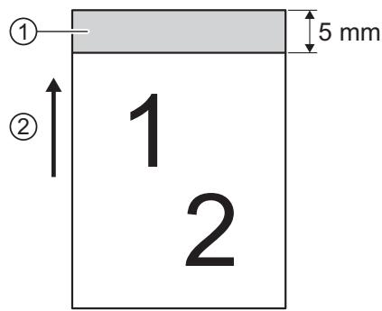

1 上边距

2 进纸方向

## 重要事项

如果纸张上边距的长度不到 5 mm，则可能会出现卡纸的情况。

## 5

## 使用设备

在使用设备之前，确保您已经：

 准备好设备 （请参见第 6 页上的使用本设备之前）。

 安装了要使用的烫金膜盒 （请参见第 12 页上的安装烫金膜盒）。如果烫金膜盒中没有烫金膜，请不要开始转印。

 准备好已预先印刷的介质，您要使用设备在这些介质上转印烫金膜。

## 重要事项

• 确保要使用的介质可接受。有关详细信息，请参见第 19 页上的介质规格。

• 建议只使用已用 Brother 单色激光打印机打印的介质。

## 5.1 转印

## 重要事项

• 在纸张顶部留出 5 mm 的页边距。为了避免卡纸，确保上边距中没有墨粉打印内容。

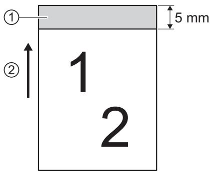

1 上边距

2 进纸方向

• 使用半幅烫金膜盒时，请确保不转印烫金膜的区域中不含墨粉打印内容以避免卡纸。

• 使用左对齐半幅烫金膜盒时，不能将烫金膜转印到小于 A5 的纸张上。

• 如果烫金膜盒中没有烫金膜，请不要开始转印作业。

## a 按 （打开 / 关闭电源）以打开设备。

等待到液晶显示屏消息从 [请等待 ] 更改为 [ 准备就绪 ]。

b 使用激光打印机打印您要转印烫金膜的纸张。

c 将纸张装入进纸托板中 （有关详细信息，请参见第 23 页上的装入介质）。正确装入纸张后，液晶显示屏消息会更改为 [ 介质设置 ?]。

使用设备

## d 按 (Start) （启动）。

液晶显示屏上会显示 [ 正在处理 ] 。

注释

烫金膜转印完成后，液晶显示屏消息更改为 [准备就绪]。要继续转印，请返回到步骤 2。

e 如果您已完成转印，请按 （打开 / 关闭电源）以关闭设备。

液晶显示屏上会显示 [ 正在关机 ] ，然后设备关闭。

## 5.2 将烫金膜转印到双面纸张上

a 使用激光打印机打印纸张的正面。

b 使用设备将烫金膜转印到纸张正面的已打印内容上。

c 打印已转印烫金膜的纸张的反面。

d 将烫金膜转印到纸张反面的已打印内容上。

## 5.3 装入介质

进纸托板可以容纳总厚度不超过 5 mm 的多页纸张并会逐一送入每张纸。使用 90 ${ \mathfrak { g } } / { \mathfrak { m } } ^ { 2 }$ 到 $3 5 0 ~ { \mathfrak { g } } / { \mathfrak { m } } ^ { 2 }$ 介质，并且始终先呈扇形展开纸张再将它们装入到进纸托板中。

## 重要事项

• 确保介质已完全干透。

• 请勿在进纸时抽拉纸张。

## 5.3.1 装入标准尺寸介质

设备与以下标准尺寸介质兼容：

 A4

 A5

 JISB5

 LTR/LGL

a 将可伸缩进纸托板翼板 1 和可伸缩纸张支撑翼板 2 从设备拉出。细心调整放置可伸缩纸张支撑翼板的位置。如果可伸缩纸张支撑翼板比介质尺寸略长，则当设备弹出装入的纸张时，可能不能保持它们原来的顺序。

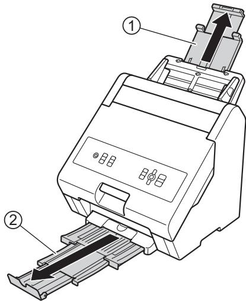

调整导纸板 1 以适合介质宽度。

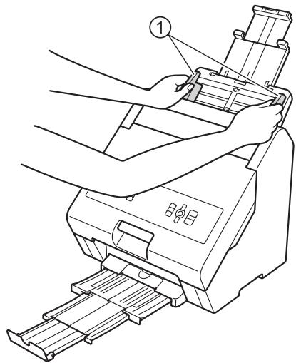

使用设备

c 沿长边或短边呈扇形展开纸张多次。

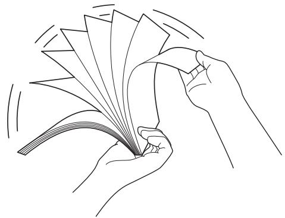

## 使纸张边缘对齐。

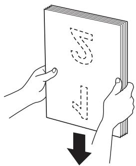

e 将纸张以正面朝下、顶边先进入的方式放入进纸托板的导纸板之间，直到感觉顶边触到设备的内部为止。小心、缓慢地送入薄纸，避免边缘折叠。

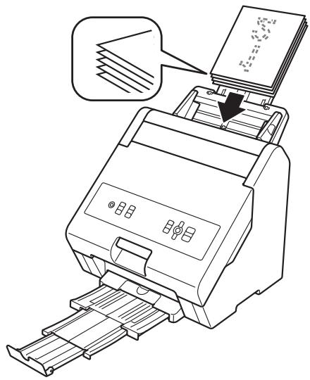

## 5.3.2 装入非标准尺寸介质

a 调整导纸板 1 以适合介质宽度。

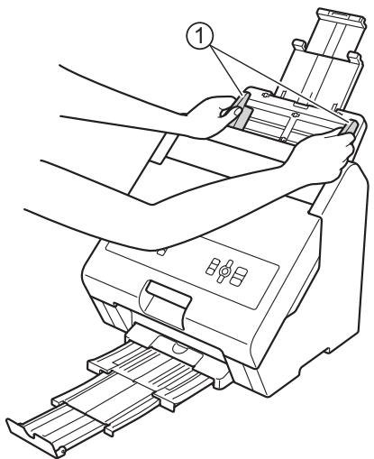

b 将纸张以正面朝下、顶边先进入的方式放入进纸托板的导纸板之间，直到感觉顶边触到设备的内部为止。

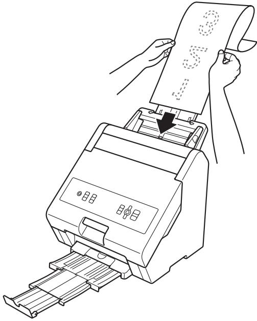

## 注释

• 设备将一直转印烫金膜，直到进纸托板中的纸张用完。

如果您在烫金膜转印期间装入另外的纸张，设备可能无法正确对齐它们并且可能无法成功地将烫金膜转印到这些新增加的纸张上。

• 仅当液晶显示屏上显示 [ 准备就绪 ] 时，才装入另外的纸张。

• 如果纸张比可伸缩进纸托板翼板长，请托住纸张以确保设备正确送入纸张。

## 更改设置

使用主菜单来更改设备的设置以及重置设备的设置和操作历史记录。

## 6.1 访问主菜单

注释

有关主菜单项的详细信息，请参见第 28 页上的菜单项。

按

(Menu) （菜单）。

b 按 ▼ 或 ▲ 选择 [ 菜单 ]，然后按 (OK) （确定）。

菜单设置将会出现。

要访问子菜单，请使用 ▼ 或 ▲。

c 要更改设置值，请按 ▼ 或 ▲ 进行选择，然后按 (OK) （确定）。

按

(Stop/Exit) （停止 / 退出）。

注释

• 要退出主菜单，请按

(Stop/Exit) （停止 / 退出）。

• 要返回到上一个菜单屏幕，请按 (Clear/Back) （清除 / 返回）。

• 在保持不操作大约 30 秒之后，设备会退出主菜单。

## 6.2 菜单项

<table><tr><td colspan="2">菜单/子菜单</td><td>概述</td><td>设置值</td></tr><tr><td colspan="2">语言</td><td>更改液晶显示屏语言。</td><td>请参见第11页上的选择液晶显示屏语言(仅第一次开机时)。</td></tr><tr><td colspan="2">自动关机</td><td>设置在不操作一段时间之后自动关闭设备的时间量。</td><td>■关■1小时■2小时■4小时■8小时</td></tr><tr><td colspan="2">温度</td><td>请参见第29页上的调整转印温度。</td><td>(-)低到高(+)有五个温度设置值可用。</td></tr><tr><td colspan="2">打印速度</td><td>请参见第30页上的更改送纸速度。</td><td>■15ppm■7.0ppm这些设置值在纸张尺寸为A4时适用。</td></tr><tr><td rowspan="4">节省烫金膜模式</td><td>关</td><td rowspan="4">请参见第31页上的节省烫金膜模式。</td><td rowspan="4">请参见第31页上的节省烫金膜模式。</td></tr><tr><td>上</td></tr><tr><td>跳过</td></tr><tr><td>中间</td></tr><tr><td rowspan="2">重置</td><td>设备重置</td><td>将主菜单设置恢复为默认设置。</td><td>-</td></tr><tr><td>出厂重置</td><td>将所有设备设置恢复为默认设置。</td><td>-</td></tr><tr><td rowspan="4">设备信息</td><td>序列号</td><td>显示序列号。</td><td>-</td></tr><tr><td>版本</td><td>显示固件版本。</td><td>-</td></tr><tr><td>页码计数器</td><td>显示已转印纸张总页数。</td><td>-</td></tr><tr><td>卡纸计数器</td><td>显示卡纸总页数。</td><td>-</td></tr></table>

更改设置

## 6.3 提高转印质量

## 6.3.1 调整转印温度

如果烫金膜很容易脱落或打印缺失，请提高设备的转印温度。

液晶显示屏上会出现转印温度更改屏幕。

## 注释

还可以按如下所示操作：按 (Menu) （菜单），然后按 ▼ 或 ▲ 选择 [ 温度 ]，然后按 (OK) （确定）。

b 按 ▼ 或 ▲ 调整温度，然后按 (OK) （确定）。

有五个转印温度设置值。默认值是中间值。

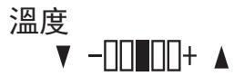

▲：以 [+] 方向提高温度。

▼：以 [-] 方向降低温度。

(Stop/Exit) （停止 / 退出）。

更改设置

## 6.3.2 更改送纸速度

如果烫金膜很容易脱落或打印缺失，请降低设备的送纸速度。

按 (Menu) （菜单）。

按 ▼ 或 ▲ 选择 [ 打印速度 ]，然后按 (OK) （确定）。

c 按 ▼ 或 ▲ 更改送纸速度，然后按 (OK) （确定）。

对于 A4 纸张尺寸，选择 7.0 ppm 或 15 ppm。

d 按 (Stop/Exit) （停止 / 退出）。

## 6.4 节省烫金膜模式

使用节省烫金膜模式，仅将烫金膜转印到纸张的特定区域。

可以选择三个节省烫金膜模式设置之一。

<table><tr><td colspan="2">上</td><td>跳过</td><td>中间</td></tr><tr><td colspan="2">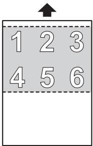</td><td>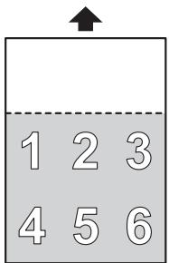</td><td>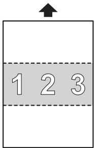</td></tr><tr><td colspan="2">指定要转印到纸张的烫金膜长度,让其余区域保留为空白。</td><td>指定从纸张顶边算起要保留为空白的区域,仅在此区域以外转印烫金膜。此模式下不可使用半幅烫金膜盒。</td><td>指定从纸张顶边算起要保留为空白的区域,然后指定要转印的烫金膜长度。此模式下不可使用半幅烫金膜盒。</td></tr><tr><td rowspan="2">进纸尺寸</td><td>节省烫金膜模式:关</td><td>宽度:55mm到225mm长度:90mm到500mm</td><td></td></tr><tr><td>节省烫金膜模式:开</td><td>宽度:55mm到225mm长度:210mm到500mm</td><td></td></tr></table>

更改设置

## 6.4.1 仅将烫金膜转印到纸张右上方（顶部）

指定要转印到纸张的烫金膜长度，让其余区域保留为空白。

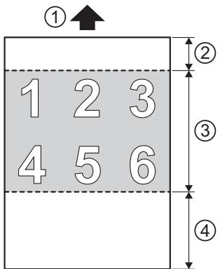

1 进纸方向

2 5 mm 页边距不含任何墨粉打印内容

3 转印区域

（烫金膜将只转印到此区域）

4 空白区域

（此区域不得包含任何墨粉打印内容）

液晶显示屏上会出现节省烫金膜模式设置屏幕。

注释

还可以按如下所示操作：按 (Menu) （菜单），然后按 ▼ 或 ▲ 选择 [ 节省烫金膜模式 ]，然后按(OK) （确定）。

b 按 ▼ 或 ▲ 选择 [ 上 ]，然后按 (OK) （确定）。

c 按 ▼ 或 ▲ 选择从纸张顶边算起的要转印烫金膜的长度 （介于 50 mm 和 170 mm 之间），然后按(OK) （确定）。

d 要退出节省烫金膜模式，请按 (Stop/Exit) （停止 /退出），然后装入介质。

e 按

(Start) （启动）。

## 6.4.2 仅将烫金膜转印到纸张的下半部分（跳过）

指定从纸张顶边算起要保留为空白的区域，仅在此区域以外转印烫金膜。此模式下不可使用半幅烫金膜盒。

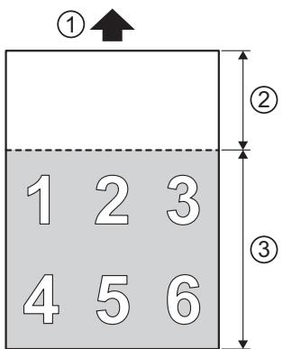

1 进纸方向

2 空白区域 （跳过）（此区域不得包含任何墨粉打印内容）

3 转印区域（烫金膜将只转印到此区域）

## a 按

(Foil Save) （节省烫金膜）。

液晶显示屏上会出现节省烫金膜模式设置屏幕。

注释

还可以按如下所示操作：按 (Menu) （菜单），然后按 ▼ 或 ▲ 选择 [ 节省烫金膜模式 ]，然后按(OK) （确定）。

b 按 ▼ 或 ▲ 选择 [ 跳过 ]，然后按 (OK) （确定）。

c 按 ▼ 或 ▲ 选择从纸张顶边算起的空白区域的长度 （介于 100 mm 和 1200 mm 之间），然后按(OK) （确定）。

d 要退出节省烫金膜模式，请按

按

(Start) （启动）。

## 6.4.3 仅将烫金膜转印到纸张中间部分 （中间）

指定从纸张顶边算起要保留为空白的区域，然后指定要转印的烫金膜长度。此模式下不可使用半幅烫金膜盒。

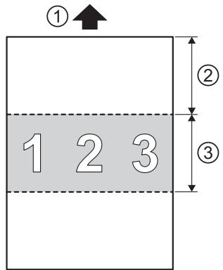

1 进纸方向

2 空白区域 （跳过）（此区域不得包含任何墨粉打印内容）

3 转印区域（烫金膜将只转印到此区域）

(Foil Save) （节省烫金膜）。

液晶显示屏上会出现节省烫金膜模式设置屏幕。

注释

还可以按如下所示操作：按 (Menu) （菜单），然后按 ▼ 或 ▲ 选择 [ 节省烫金膜模式 ]，然后按(OK) （确定）。

b 按 ▼ 或 ▲ 选择 [ 中间 ]，然后按 (OK) （确定）。

c 按 ▼ 或 ▲ 选择从纸张顶边算起的空白区域的长度 （介于 100 mm 和 1200 mm 之间），然后按(OK) （确定）。

d 按 ▼ 或 ▲ 选择跳过纸张上半部分后要转印的烫金膜长度 （介于 30 mm 和 1100 mm 之间），然后按(OK) （确定）。

e 要退出节省烫金膜模式，请按 (Stop/Exit) （停止 / 退出），然后装入介质。

按

(Start) （启动）。

更改设置

## 6.4.4 关闭节省烫金膜模式

a 按 (Foil Save) （节省烫金膜）。

液晶显示屏上会出现节省烫金膜模式设置屏幕。

注释

还可以按如下所示操作：按 (Menu)（菜单），然后按 ▼ 或 ▲ 选择 [ 节省烫金膜模式 ]，然后按

(OK) （确定）。

b 按 ▼ 或 ▲ 选择 [ 关 ]，然后按 (OK) （确定）。

c 按 (Stop/Exit) （停止 / 退出）。

更改设置

## 6.5 收藏

保存常用的转印设置以快速访问。可以指定下列设置：

 转印温度

 送纸速度

 节省烫金膜模式设置

## 6.5.1 将收藏设置分配给操作面板按键

a 按 (Favorite1) （收藏 1）或 (Favorite2) （收藏 2）。

液晶显示屏上会出现 [ 立即注册 ?]

注释

如果有任何收藏设置已分配给您按下的收藏按键，则液晶显示屏会根据您按下的按键显示 [ 收藏 #01] 或[ 收藏 #02]。

按 ▲。

c 设置转印温度。

有关详细信息，请参见 第 29 页上的调整转印温度。

设置送纸速度。

有关详细信息，请参见 第 30 页上的更改送纸速度。

设置 “ 节省烫金膜模式 ” 设置。

有关详细信息，请参见 第 31 页上的节省烫金膜模式。

## 6.5.2 调出收藏

a 按 (Favorite1) （收藏 1）或 (Favorite2) （收藏 2）。

便会调出收藏。根据您按下的按键，液晶显示屏上会出现 [ 收藏 #01] 或 [ 收藏 #02] 。

注释

如果未将任何收藏设置分配给您按下的收藏按键，则将会出现 [ 立即注册 ?] 。

## b 确保介质已正确装入，然后按

烫金膜转印便会开始。

## 6.5.3 覆盖或删除收藏

a 当 [ 准备就绪 ] 或 [ 介质设置 ?] 出现在液晶显示屏上时，按 ▲。[ 选择收藏 ] 会出现在液晶显示屏上。

b 按 (Favorite1) （收藏 1）或 (Favorite2) （收藏 2）以覆盖或删除已分配给此按键的设置。您按下的收藏按键的编号和 [▲ 更改 ▼ 清除 ] 会出现在液晶显示屏上。

c 要覆盖收藏：

按 ▲。收藏覆盖屏幕将会出现。分配新的收藏。

要删除收藏：

按 ▼。 [删除此数据 ?] 将会此出现。按 ▲ 以删除收藏。

d 按 (Stop/Exit) （停止 / 退出）。

更改设置

## 6.6 重置设置

您可以使用设备的操作面板来将主菜单设置和设备设置重置为其默认设置。

按 (Menu) （菜单）。

b 按 ▼ 或 ▲ 选择 [ 重置 ]，然后按 (OK) （确定）。

c 按 ▼ 或 ▲ 选择 [ 设备重置 ] 或 [ 出厂重置 ]，然后按 (OK) （确定）。

 设备重置：将主菜单设置重置为其默认设置。

 出厂重置：将所有设备设置重置为其默认设置。

d 按 ▲。

[ 是否重新启动 ?] 会出现在液晶显示屏上。

e 按 ▲。

设备会重新启动，并且设置将会重置。

## 注释

要返回到上一个菜单屏幕，请按 (Clear/Back) （清除 / 返回）。

## 6.7 更改介质送入压力

当您使用粗糙的纸张，设备可能会一次送入多张纸，从而导致错误。如果出现这种情况，请使用进纸调节器降低介质送入压力。

## 注释

• 请确保以相同的方式调整两颗螺丝钉，以避免不均匀送纸。

• 如果需要，使用一字螺丝刀来调整进纸调节器螺丝钉。

打开进纸调节器舱盖 1 并逆时针转动进纸调节器螺丝钉 2，如图中所示。

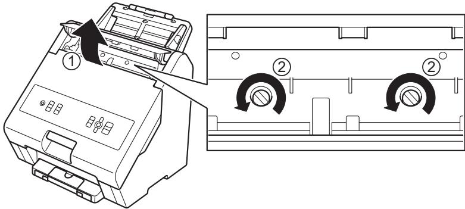

## 7

## 日常维护

## 7.1 清洁设备的外部

a 使用柔软的无绒干抹布擦去操作面板上的灰尘。

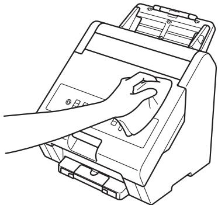

将可伸缩出纸托板翼板拉出到设备外。

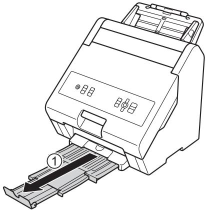

使用柔软的无绒干抹布擦拭出纸托板内侧和可伸缩出纸托板翼板以去除灰尘。

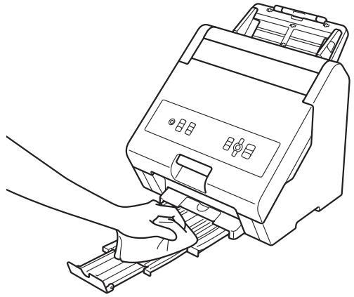

将可伸缩出纸托板翼板牢固地插回设备中。

## 7.2 清洁分离辊

关闭设备并拔下电源线。

取出进纸托板，如图中所示。

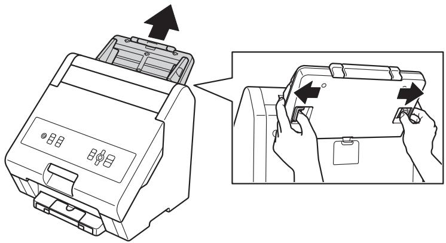

c 打开设备背面的分离辊舱盖 1，使用柔软的湿抹布清洁分离辊 2。

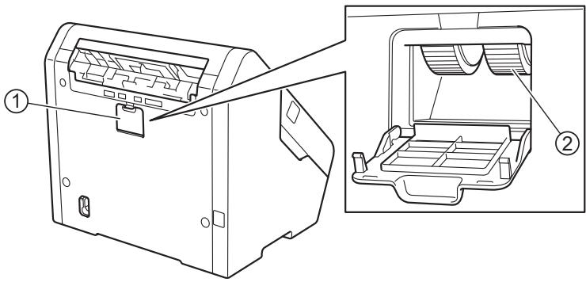

关闭分离辊舱盖。

重新安装进纸托板。

## 故障排除

## 8.1 概述

本章阐述如何解决您在使用 Brother 设备过程中可能会遇到的常见问题。

## 8.2 确定问题

确保已检查下列内容：

 已正确连接电源线，且设备已开机。

 已去除所有包装材料。

 前盖和分离辊舱盖已正确盖好。

## 8.2.1 一般设备操作

<table><tr><td>问题</td><td>原因</td><td>操作</td></tr><tr><td>电源意外中断。</td><td>■ 电源线未正确连接。■ 设备需要养护。</td><td>■ 检查电源线已正确连接。■ 如果此操作不能解决问题,请联系您当地的Brother经销商。</td></tr><tr><td>前盖未完全盖好。</td><td>烫金膜盒支架和烫金膜盒组件未正确安装。</td><td>请参见第9页上的连接设备并安装进纸托板和烫金膜盒,然后重新装入烫金膜盒支架和烫金膜盒组件。</td></tr><tr><td rowspan="3">前盖未打开。</td><td>前盖已锁定,因为设备内部的温度非常高。</td><td>等待到设备冷却下来。</td></tr><tr><td>前盖已锁定,因为设备正在转印。</td><td>等待到设备完成烫金膜转印。</td></tr><tr><td>前盖锁定时设备已关闭。</td><td>■ 再次打开电源。■ 如果前盖仍然锁定,请等待到设备冷却下来。</td></tr></table>

## 8.2.2 打印质量问题

<table><tr><td>问题</td><td>原因</td><td>操作</td></tr><tr><td rowspan="5">烫金膜不转印。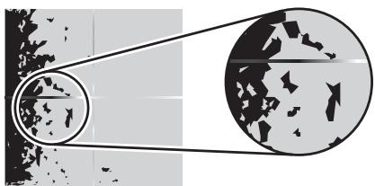</td><td>转印温度太低。</td><td>提高转印温度。请参见第29页上的调整转印温度。</td></tr><tr><td>纸张是使用使用非墨粉方法打印的。</td><td>使用含有墨粉打印内容的纸张。</td></tr><tr><td>纸张污脏。</td><td>使用干净的纸张。</td></tr><tr><td>设备内部的热转印辊污脏。</td><td>请联系您当地的Brother经销商。</td></tr><tr><td>定影单元寿命将尽。</td><td>请联系您当地的Brother经销商。</td></tr><tr><td>打印内容脱落。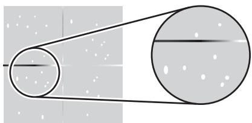</td><td>墨粉稳固效果差。</td><td>使用激光打印机重新打印纸张。</td></tr><tr><td rowspan="2">转印区域模糊。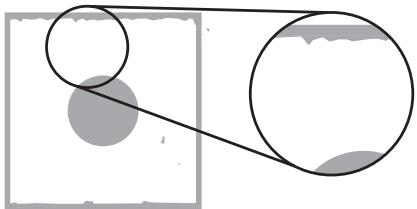</td><td>转印温度太高。</td><td>降低转印温度。请参见第29页上的调整转印温度。</td></tr><tr><td>设备的内部温度太高。</td><td>等待设备冷却下来,然后重试。</td></tr><tr><td rowspan="3">打印的文本不清晰。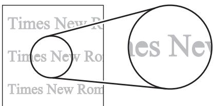</td><td>转印温度太高。</td><td>降低转印温度。请参见第29页上的调整转印温度。</td></tr><tr><td>设备的内部温度太高。</td><td>等待设备冷却下来,然后重试。</td></tr><tr><td>文本太小。</td><td>使用14pt或更大的字体。</td></tr><tr><td>烫金膜转印到整张纸上。</td><td>使用了不受支持的介质类型。</td><td>仅使用受支持的介质类型。</td></tr><tr><td>转印的烫金膜脱落。</td><td>转印温度太低。</td><td>提高转印温度。请参见第29页上的调整转印温度。</td></tr><tr><td>未转印任何内容。</td><td>纸张的正反面检测错误。</td><td>正确装入介质。</td></tr></table>

8.2.3 介质送入问题

<table><tr><td>问题</td><td>原因</td><td>操作</td></tr><tr><td rowspan="5">纸张不送入。</td><td>纸张太厚。</td><td>不要使用重量超过350g/m2的介质。</td></tr><tr><td>未正确装入纸张。</td><td>调整纸张顶边的位置,然后重试。</td></tr><tr><td>纸张卷曲。</td><td>压平纸张,然后重试。</td></tr><tr><td>分离辊污脏。</td><td>清洁分离辊。请参见第41页上的清洁分离辊。</td></tr><tr><td>同时装入了不同尺寸的纸张。</td><td>■一次装入一种纸张。■分批装入纸张,每批只包含尺寸类似的纸张。</td></tr><tr><td rowspan="2">纸张有褶皱。</td><td>未正确装入纸张。</td><td>使用导纸板展平纸张。</td></tr><tr><td>纸张太薄。</td><td>不要使用重量不到90g/m2的介质。</td></tr><tr><td rowspan="5">发生多张进纸。这可能导致打印内容缺失或卡纸。</td><td>不支持同时转印到多张纸上。</td><td>一次装入一张纸。</td></tr><tr><td>在可伸缩进纸托板翼板上装入的纸张太多。</td><td>在可伸缩进纸托板翼板上装入少一些纸张。</td></tr><tr><td>分离辊污脏。</td><td>清洁分离辊。请参见第41页上的清洁分离辊。</td></tr><tr><td>同时装入了不同尺寸的纸张。</td><td>■一次装入一种纸张。■分批装入纸张,每批只包含尺寸类似的纸张。</td></tr><tr><td>-</td><td>使用进纸调节器降低介质送入压力。请参见第39页上的更改介质送入压力。</td></tr></table>

## 8.3 卡纸

## 8.3.1 如果卡纸导致“ 无进纸 ” 错误

如果卡纸发生在介质送入到设备中之前，[无进纸] 会出现在液晶显示屏上。请按照以下步骤操作来清除卡纸：

a 如果送入多张纸，请将它们取出来。

b 用双手轻轻地将卡住的纸张拉出到设备外。

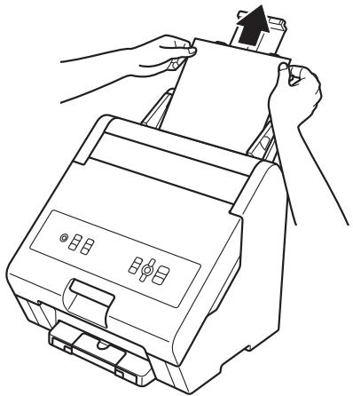

## 8.3.2 如果卡纸发生在设备内部

如果卡纸发生在设备内部， [ 内部卡纸 ] 会出现在液晶显示屏上。请按照以下步骤操作来清除卡纸：

## 警告

设备的内部零件温度将会很烫。请等待设备冷却后再触摸他们。

a 确保 Cover Lock （盖锁定） LED 指示灯熄灭。

b 打开前盖。

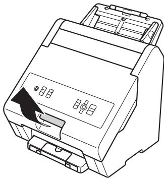

c 用双手轻轻地将卡住的纸张拉出到设备外。

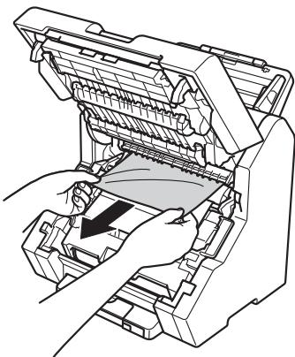

## 注释

• 用双手将卡住的纸张向下拉，使得您可以更轻松地将它取出来。

• 如果纸张的边缘卡住并导致您无法将纸张向下拉，请按箭头所示方向拉纸张的边缘，然后用双手轻轻地将纸张拉出来。

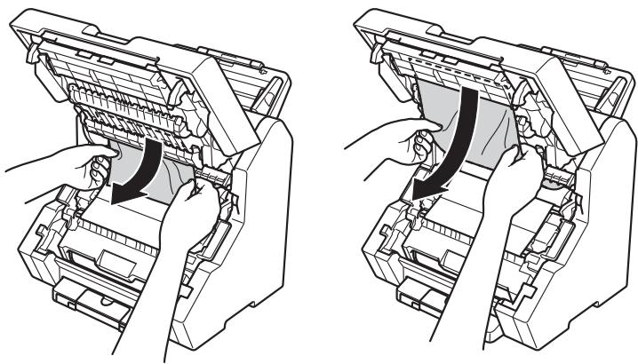

## 8.3.3 如果纸张卡纸和烫金膜卡纸同时发生

如果纸张没有 5 mm 的页边距，则它可能会缠绕在烫金膜侧，或者烫金膜可能会松弛。如果出现这种情况，请取出纸张并使用下面的步骤消除烫金膜松弛的情况：

## 警告

设备的内部零件温度将会很烫。请等待设备冷却后再触摸他们。

a 确保 Cover Lock （盖锁定） LED 指示灯熄灭。

打开前盖。

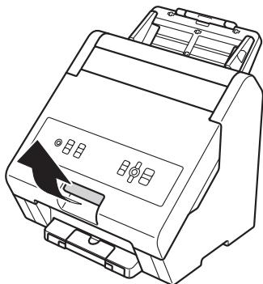

c 提起烫金膜盒支架和烫金膜盒组件的下半部分 1，然后将整个烫金膜盒支架和烫金膜盒 2 向上提起，以将它从设备中取出。

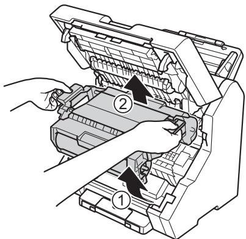

故障排除

打开烫金膜盒支架盖。

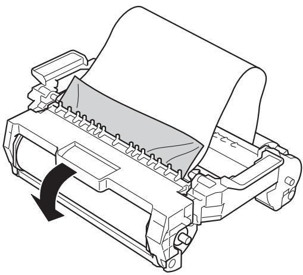

取出卡住的纸张。

顺时针转动主轴 1 以消除松弛。

## 9.1 一般规格

<table><tr><td colspan="2">转印技术</td><td>定影单元</td></tr><tr><td colspan="2">液晶显示屏 (LCD)</td><td>20 个字符 x 2 行</td></tr><tr><td colspan="2">电源</td><td>220 V-240 VAC 50 Hz / 60 Hz</td></tr><tr><td rowspan="3">功耗</td><td>烫金膜转印</td><td>约 340 W</td></tr><tr><td>准备就绪</td><td>约 7 W</td></tr><tr><td>断电时</td><td>约 0.04 W</td></tr><tr><td colspan="2" rowspan="4">尺寸</td><td>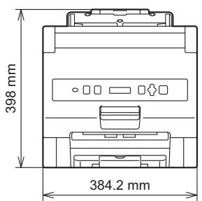</td></tr><tr><td>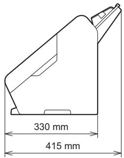</td></tr><tr><td>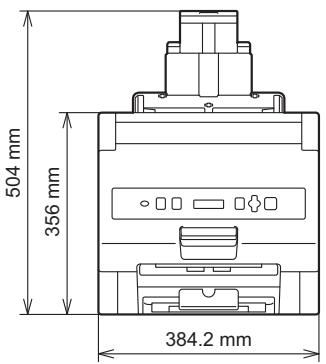</td></tr><tr><td>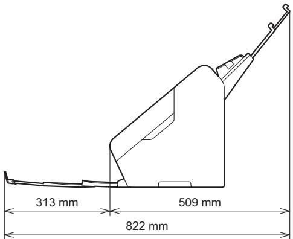</td></tr><tr><td colspan="2" rowspan="2">重量(含耗材)</td><td>16.3 kg(包括全幅烫金膜盒)</td></tr><tr><td>16.1 kg(包括半幅烫金膜盒)</td></tr><tr><td rowspan="2">温度</td><td>工作时</td><td>10°C到32°C</td></tr><tr><td>贮藏时</td><td>0°C到40°C</td></tr><tr><td rowspan="2">湿度</td><td>工作时</td><td>20%到80%(无冷凝)</td></tr><tr><td>贮藏时</td><td>10%到95%(无冷凝)</td></tr></table>

## 9.2 打印介质规格

<table><tr><td>介质尺寸</td><td>宽度:55 mm 到 225 mm长度:90 mm 到 500 mm</td></tr><tr><td>介质重量</td><td>90 g/m2 到 350 g/m2</td></tr><tr><td>介质类型</td><td>普通纸、薄纸、再生纸、厚纸、特种纸</td></tr></table>

## 9.3 设备规格

<table><tr><td>纸张输入 (A4)</td><td>44 张纸 ( $90 \, g/m^{2}$ )12 张纸 ( $350 \, g/m^{2}$ )</td></tr><tr><td>纸张输出</td><td>44 张纸,正面朝下 ( $90 \, g/m^{2}$ )12 张纸,正面朝下 ( $350 \, g/m^{2}$ )</td></tr><tr><td>最大转印速度 (A4)</td><td>最高 15 ppm</td></tr><tr><td>进纸尺寸</td><td>宽度:55 mm 到 225 mm长度:90 mm 到 500 mm</td></tr><tr><td>进纸尺寸(节省烫金膜模式)</td><td>宽度:55 mm 到 225 mm长度:210 mm 到 500 mm</td></tr><tr><td>转印区域</td><td>宽度:最大 215.9 mm长度:最大 500 mm</td></tr><tr><td>半幅烫金膜位置</td><td>■ 中心■ 左</td></tr><tr><td>双面转印</td><td>手动</td></tr><tr><td>定影单元寿命</td><td>约 80,000 页 *</td></tr></table>

\* 更换频率因所用介质类型不同而有所不同。如果您未能完成转印，则表示定影单元寿命已尽。如需更换定影单元，请联系 Brother 经销商。

## 9.4 耗材

当需要更换耗材 （例如烫金膜盒）时，设备的操作面板上会出现错误消息。有关设备耗材的更多信息，请访问 www.brother.com/original/index.html 或联系您当地的 Brother 经销商。

## 注释

“ 耗材型号名称 ” 会因国家和地区而异。

## 10 错误消息

任何一种完善的办公产品都有可能出现错误并且都必须更换耗材。如果出现这种情况，设备会识别错误并显示相应的消息。

表格中显示了最常见的错误消息。

您可以自行纠正大部分错误并清除日常维护信息。如果需要更多帮助， Brother技术服务支持网站(www.95105369.com) 将为您提供最新的常见问题解答与产品使用技巧。

<table><tr><td>错误消息</td><td>原因</td><td>操作</td></tr><tr><td>无法打印 ##其中“##”是两位数的识别号。</td><td>■盖锁定无法释放或已被锁定。如果您在尝试释放盖锁定时触摸前盖把手,则可能会出现这种情况。■机械/硬件故障。</td><td>打开/关闭电源。如果此操作不能解决问题,请联系您当地的Brother经销商。</td></tr><tr><td rowspan="2">纸张尺寸不正确</td><td>节省烫金膜模式设置和所装入介质的尺寸不匹配。</td><td>1. 按(Stop/Exit)(停止/退出)。2. 确保节省烫金膜模式设置与所装入介质的尺寸匹配(请参见第31页上的节省烫金膜模式)。</td></tr><tr><td>连续送入多种纸张宽度。</td><td>1. 按(Stop/Exit)(停止/退出)。2. 装入更多宽度相同的纸张。</td></tr><tr><td>更换烫金膜盒</td><td>烫金膜盒中无烫金膜。</td><td>■Cover Lock(盖锁定)LED指示灯熄灭时,换用新的烫金膜盒。■如果任何介质保留在设备内部,请取出(请参见第45页上的卡纸)。</td></tr><tr><td>无烫金膜</td><td>烫金膜盒未正确装入。</td><td>■检查烫金膜盒是否正确装入。■检查烫金膜盒是否正确锁定在烫金膜盒支架中。■检查烫金膜盒的耗材型号是否适合设备。</td></tr></table>

## 11 附录

## 11.1 Brother 帮助和客户支持

## 重要事项

要获得技术帮助，请联系 Brother 呼叫中心或您当地的 Brother 经销商。

## 11.1.1 FAQ （常见问题解答）

Brother技术服务支持网站是一站式资源中心，可满足所有设备的需要。请访问 www.95105369.com 以阅读FAQ 和故障排除技巧，了解如何充分利用 Brother 产品。

## 11.1.2 Brother 联系信息

请访问 www.brother.cn/，以了解您当地的 Brother 办事处的联系信息。

附录

## 11.2 法规

## 11.2.1 开放源代码许可备注

本产品包含开放源代码软件。

转至 Brother 技术服务支持网站 (support.brother.com) 所需型号主页的说明书下载部分，以查看 “ 开放源代码许可备注和版权信息 ”。

## 11.2.2 客户创作的设计侵犯版权

使用本产品时，客户应采取充分的预防措施，以免侵犯 Brother 和第三方的版权和其他权利。

即使第三方声称客户使用本产品创作的设计侵犯了版权或其他权利， Brother 也不承担任何责任。

## 11.2.3 不保证 HAK 180 的商业使用可获得利润

Brother 不保证因客户使用本产品或通过本产品创作的任何内容，或通过交付或分发此类印刷品而产生任何销售利润或其他附带影响，如业务绩效、品牌和形象提升， Brother 也不保证不会发生任何类型的损害。

## brother